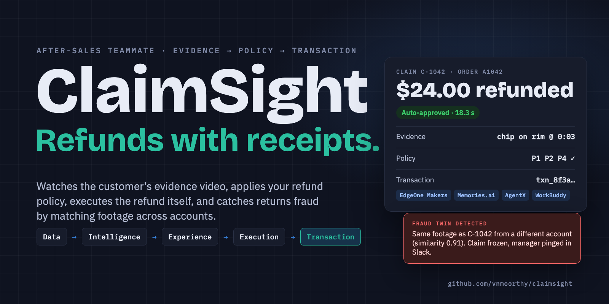
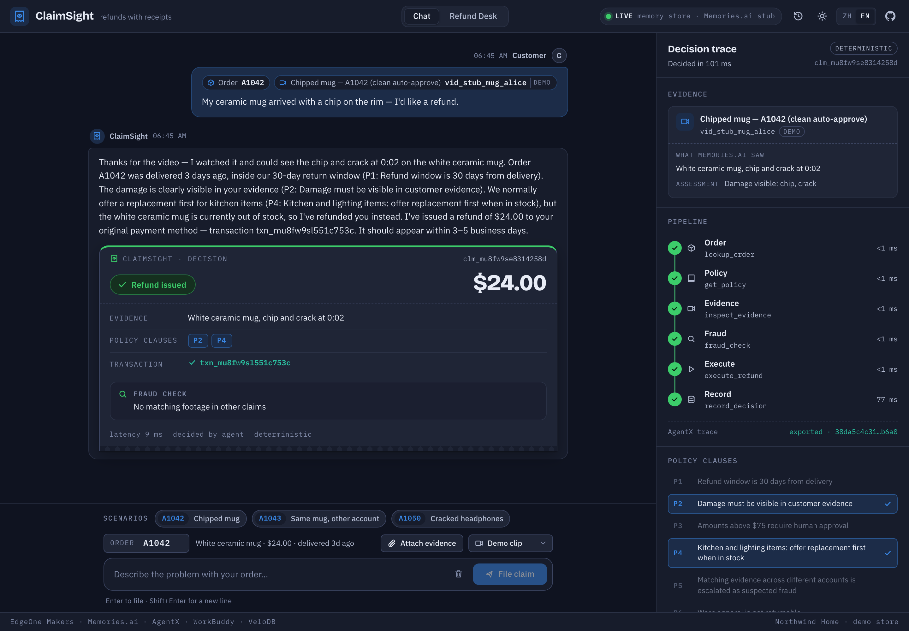
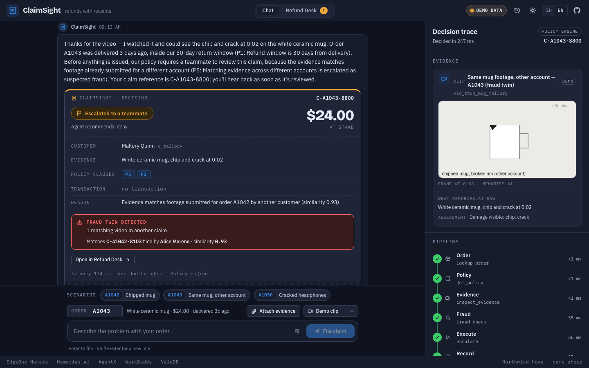
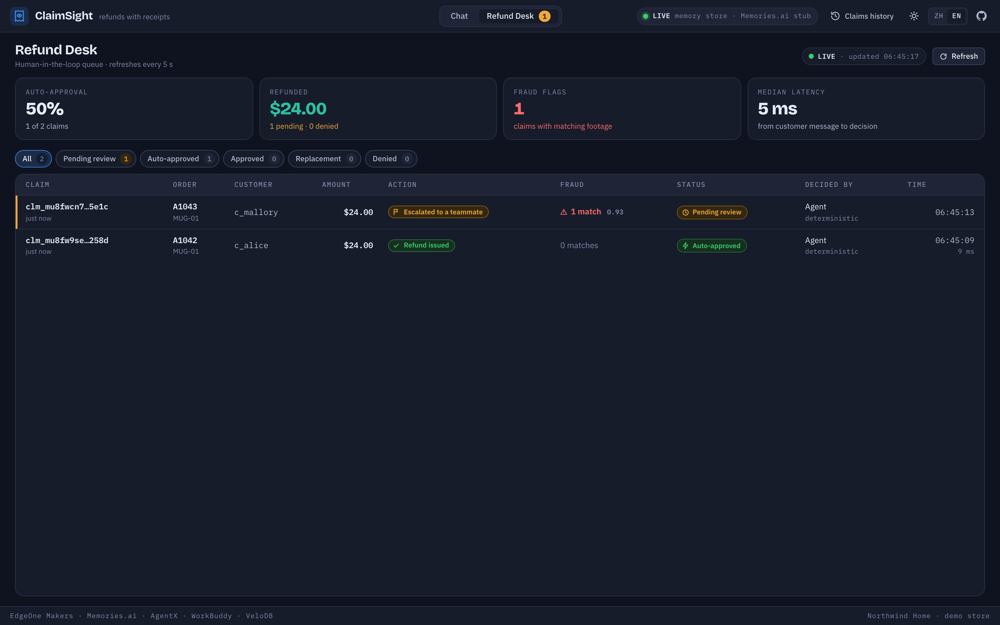
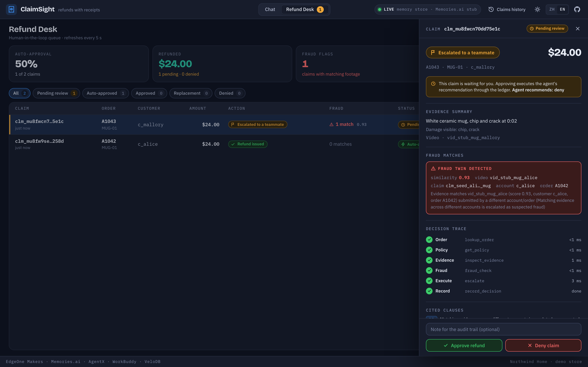
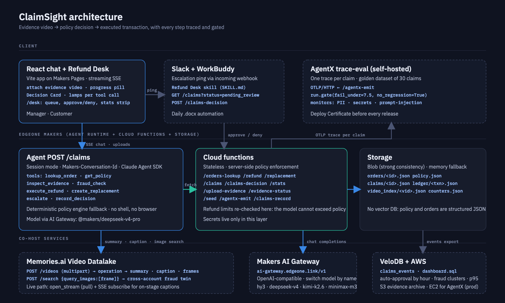
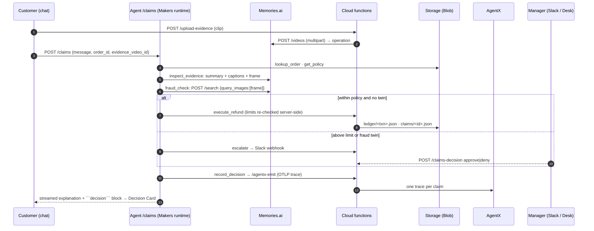
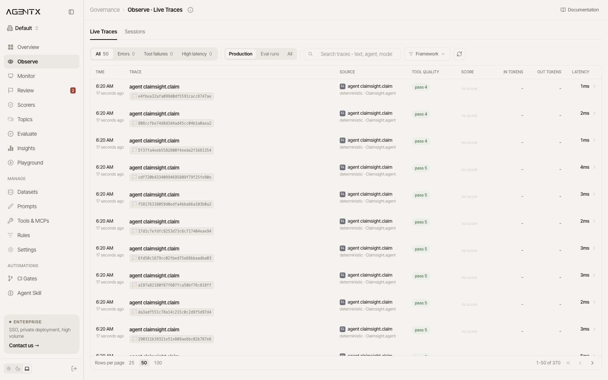
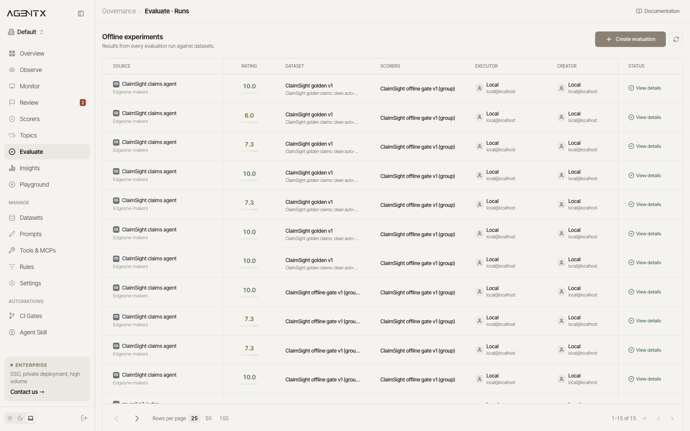

<p align="center">
  
</p>

<h1 align="center">ClaimSight</h1>
<p align="center"><strong>Refunds with receipts.</strong><br>
An after-sales teammate that watches the customer's evidence video, applies your refund policy, executes the refund itself, and catches returns fraud by matching footage across accounts.</p>

<p align="center">
  <a href="https://github.com/vnmoorthy/claimsight/actions/workflows/ci.yml"></a>
  <a href="LICENSE"></a>
  
  
  
  
</p>

<p align="center">
  <a href="#-live-demo">Live demo</a> ·
  <a href="#-how-a-claim-flows">How it works</a> ·
  <a href="#-quickstart">Quickstart</a> ·
  <a href="#-production-readiness">Production readiness</a> ·
  <a href="#-sponsor-technologies">Sponsor tech</a> ·
  <a href="docs/deck/ClaimSight-deck.pptx">Deck (pptx)</a> ·
  <a href="docs/deck/ClaimSight-deck.pdf">Deck (pdf)</a> ·
  <a href="docs/STORYBOARD.md">3-minute storyboard</a> ·
  <a href="docs/DEMO_CHECKLIST.md">Stage checklist</a>
</p>

---

## Why

Return fraud cost US retailers **$101 billion in 2023** ([NRF & Appriss Retail](https://nrf.com/media-center/press-releases/nrf-and-appriss-retail-report-743-billion-merchandise-returned-2023)). Every refund still needs a human to squint at a photo, guess, and either overpay or escalate everything. And the same cracked mug gets filmed for three claims from three "customers", which no refund queue can see.

ClaimSight closes the loop the way the hackathon's thesis describes it: **Data → Intelligence → Experience → Execution → Transaction.** It does not stop at a chat answer. It writes the ledger entry.

## What it does

| | Feature | How |
|---|---|---|
| 👁 | **Sees the evidence** | The customer attaches a 10-second clip. Memories.ai indexes it into captions, frames and a summary: *"white ceramic mug, chip on the rim at 0:03"*. |
| 📜 | **Applies your policy** | Orders and policy clauses P1–P6 live as structured JSON in EdgeOne Makers storage. No vector database. Every decision cites the clauses it used. |
| 💳 | **Executes the transaction** | Refund or replacement is written to the ledger by a cloud function that re-checks the limits itself. The model cannot exceed policy even when asked to. |
| 🔍 | **Catches the fraud twin** | Before paying, a frame from the new clip is image-searched across every prior claim. A 0.93 match from another account freezes the claim (P5). |
| 🙋 | **Pulls a human in only when it matters** | Above $75 or on a fraud signal, the claim is escalated to Slack through a WorkBuddy **Refund Desk** skill, and to the in-app desk, where a manager approves or denies with one click. |
| 🧾 | **Explains itself** | A streaming Decision Card: action, amount, evidence line, cited clauses, fraud matches, transaction id, latency. |
| 🛡 | **Ships like software** | 30 golden claims, an LLM policy judge, a deploy gate with a no-regression check, PII/secrets/prompt-injection monitors, and one trace per claim in AgentX. |
| 🔁 | **Never dies on stage** | A deterministic policy engine runs the same steps in code when no model is configured or the gateway blinks, producing the identical card. |

## 📸 Live demo

| Chat: claim → Decision Card | The fraud twin, caught before payment |
|---|---|
|  |  |
| **Refund Desk: the human-in-the-loop queue** | **Claim drawer: evidence, trace, approve or deny** |
|  |  |

**Try it:** `[demo URL]` · Scenario presets are built into the composer: *Chipped mug, order A1042* (auto-refund), *Same mug, other account, A1043* (fraud twin → escalation), *Headphones $129, A1050* (above the limit → human approval).

## 🧭 How a claim flows

<p align="center"></p>



**Tools the agent can call** (custom MCP server, least privilege: no shell, no browser, no keys): `lookup_order` · `get_policy` · `inspect_evidence` · `fraud_check` · `execute_refund` · `create_replacement` · `escalate` · `record_decision`.

**Policy** (`data/policy.json`): P1 30-day window · P2 damage must be visible in evidence · P3 above $75 needs a human · P4 kitchen/lighting: replacement first when in stock · P5 matching evidence across accounts is escalated as suspected fraud · P6 worn apparel is not returnable.

## 🚀 Quickstart

```bash
git clone https://github.com/vnmoorthy/claimsight && cd claimsight
npm install
cp .env.example .env        # works out of the box: memory storage, stubbed Memories.ai, deterministic policy engine
npm install -g edgeone      # EdgeOne Makers CLI
edgeone makers dev -n claimsight   # backend on http://localhost:8088 (+ /agent-metrics tracing dashboard)
npm run dev                 # UI on http://localhost:5173 (proxies API routes to 8088)
```

Open the app, pick the demo clip *Chipped mug — A1042*, press **File claim**, and watch the trace light up. Before a rehearsal, press **Reset demo data** in the Refund Desk (it re-seeds orders and clears the ledger, so A1042 can be refunded again).

**Go live** (edit `.env`):

| Variable | What it does |
|---|---|
| `AI_GATEWAY_API_KEY` / `AI_GATEWAY_MODEL` | Makers AI Gateway key and model (`@makers/deepseek-v4-pro`, `@makers/kimi-k2.6`, …). Unset → deterministic policy engine. |
| `MEMORIES_API_KEY` / `MEMORIES_CLAIMS_COLLECTION` | Memories.ai Video Datalake key and the collection evidence is indexed into. Unset or `MEMORIES_STUB=1` → canned responses from `data/stubs/`. |
| `FRAUD_SIMILARITY_THRESHOLD` | Frame-embedding score at or above which a match counts as a twin (default 0.80). |
| `SLACK_WEBHOOK_URL` | Incoming webhook for escalations (optional). |
| `AGENTX_OTLP_URL` / `AGENTX_API_KEY` | Where each claim's trace is sent (self-hosted AgentX). |
| `STORAGE` | `auto` (Blob with strong consistency on Makers, memory fallback locally), `blob`, `memory`. |
| `ADMIN_TOKEN` | Protects `POST /seed` and `POST /claims-record`. |
| `AWS_S3_BUCKET` (+ region, keys, optional `AWS_S3_ENDPOINT`) | Turns on the S3 evidence archive: every clip is copied to `claims/<order>/<video_id>.mp4` with order and video metadata. `npm run archive:smoke` tests it. |
| `AGENT_MODE` | `llm` or `deterministic`; empty = auto (deterministic when no model key is set). |

**Preflight** before a demo: `npm run preflight` checks the backend, the AI Gateway key, Memories.ai (and that the demo clips are indexed), AgentX, Slack and the S3 archive in one command.

**Deploy** to EdgeOne Makers: `edgeone login`, then `edgeone makers deploy -n claimsight --area overseas` (or import the repo in the Makers console for git-push deploys).

## 🛡 Production readiness

```bash
pip install -r eval/requirements.txt
agentx-trace-eval --dev                      # self-hosted AgentX on http://localhost:4700
export AGENTX_API_BASE_URL=http://localhost:4700/api/v1 AGENTX_API_KEY=agtx_local_…   # printed at startup
python eval/run_eval.py --dry-run --offline-scorer   # 30 golden claims → DEPLOY CERTIFICATE, exit 0 on pass
python eval/run_eval.py                              # live: hits POST /claims for every case; LLM judge needs OPENAI_API_KEY on the engine
python eval/monitors.py                              # enables PII / secrets / prompt-injection scorers + a "refund without txn id" pattern
```

| AgentX Observe: one trace per claim | AgentX Evaluate: gated runs |
|---|---|
|  |  |

The gate is `run.gate(fail_under=7.5, no_regression=True)`. CI runs the dry-run gate on every push ([ci.yml](.github/workflows/ci.yml)). Injecting eight wrong decisions drops the mean to 7.33 and the job fails with exit code 1.

## 🧩 Sponsor technologies

| Tool | Role in ClaimSight |
|---|---|
| **Tencent EdgeOne Makers** | Agent runtime (session mode, `Makers-Conversation-Id`), cloud functions, Blob storage, AI Gateway models, streaming SSE UI, tracing dashboard, one-command deploy. |
| **Memories.ai** | Video Datalake: multipart upload, async indexing, summary and captions, frame extraction, image search over the claims collection (the fraud twin). Live path: `open_stream` + SSE captions for on-stage streaming. |
| **AgentX** | Self-hosted trace-eval: golden dataset, policy-compliance judge, CI gate with no-regression check, online monitors, a trace per claim. |
| **WorkBuddy** | `workbuddy/refund-desk` skill: pulls escalations, summarizes evidence and fraud matches, applies approve/deny, posts to Slack; daily .docx digest automation. |
| **VeloDB** | `velodb/schema.sql`, `load.py`, `dashboard.sql`: auto-approval by hour, refunded dollars, fraud clusters, p95 latency. Verified end to end against Apache Doris 2.1 (the engine under VeloDB) in Docker: schema, loader and all 12 queries. |
| **AWS** | S3 evidence archive on every upload (`cloud-functions/_archive.ts`, verified against an S3-compatible store), plus `aws/claimsight-infra.yaml`: a CloudFormation stack for the private evidence bucket and an EC2 host running the AgentX engine and the live-stream relay. |

## 🗂 Repository layout

```
agents/claims/          the ClaimSight agent (Claude Agent SDK + custom MCP tools, deterministic fallback)
cloud-functions/        orders-lookup · refund · replacement · claims · claims-decision · stats · upload-evidence · evidence-status · seed · agentx-emit
src/                    React app: chat, Decision Card, decision trace, Refund Desk
data/                   orders.json · policy.json · golden_claims.json · demo_evidence.json · stubs/
eval/                   AgentX harness: run_eval.py (gate), monitors.py
aws/                    CloudFormation (S3 evidence bucket + EC2 host), EC2 bootstrap for AgentX and the MediaMTX live relay
workbuddy/refund-desk/  WorkBuddy skill (SKILL.md + config.yaml)
velodb/                 schema.sql · dashboard.sql · load.py
docs/                   deck (pptx, pdf, generator), STORYBOARD.md, DEMO_CHECKLIST.md, SUBMISSION.md, BACKEND.md
scripts/                local-harness.ts (Makers-compatible local runtime), index-demo-clips.ts (Memories.ai indexing)
assets/                 banner, architecture diagram, AgentX captures, synthetic test clips
```

## 🔌 API

| Route | Purpose |
|---|---|
| `POST /claims` | The agent. Body `{message, order_id, evidence_video_id?, stream?}`; SSE by default, JSON `{text, decision}` with `stream:false`. Header `Makers-Conversation-Id`. |
| `POST /upload-evidence` · `POST /evidence-status` | Proxy the clip to Memories.ai and poll indexing (`preprocess → index → derive`). |
| `POST /orders-lookup` · `GET /demo-evidence` | Order lookup and the pre-indexed demo clips. |
| `POST /refund` · `POST /replacement` | The transaction. Limits re-checked here; above the limit requires `x-human-approved: true`. |
| `GET /claims` · `POST /claims-decision` · `GET /stats` | Refund Desk queue, human decisions, live counters. |
| `POST /seed` · `POST /agentx-emit` | Seed data · one OTLP trace per claim. |

## 🗺 Roadmap

- Live evidence: phone → MediaMTX relay (see `aws/`) → Memories.ai `open_stream`, captions on stage in real time
- Replacement inventory sync and carrier label generation
- Multi-merchant policy packs and a policy editor in the desk
- Judge calibration from manager overrides (AgentX feedback loop)

## 🏁 Built at

**The Executable World: A Full Stack AI Hackathon & Mixer**, San Francisco, September 19, 2026. Track 1, AI Assistants. Co-hosts: Tencent EdgeOne, WorkBuddy, AgentX, Memories.ai, VeloDB, AWS.

## License

[MIT](LICENSE)
